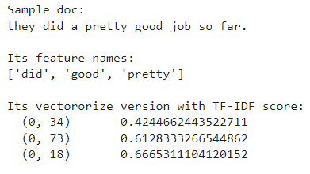
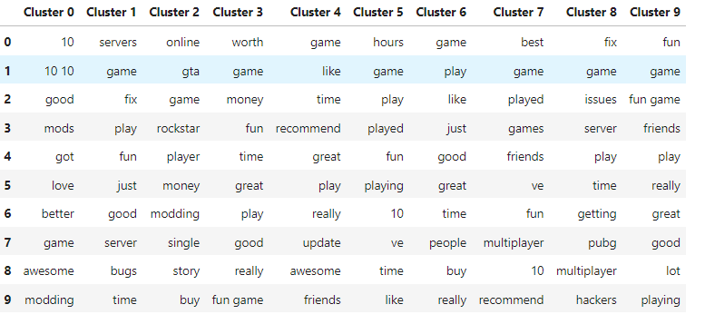
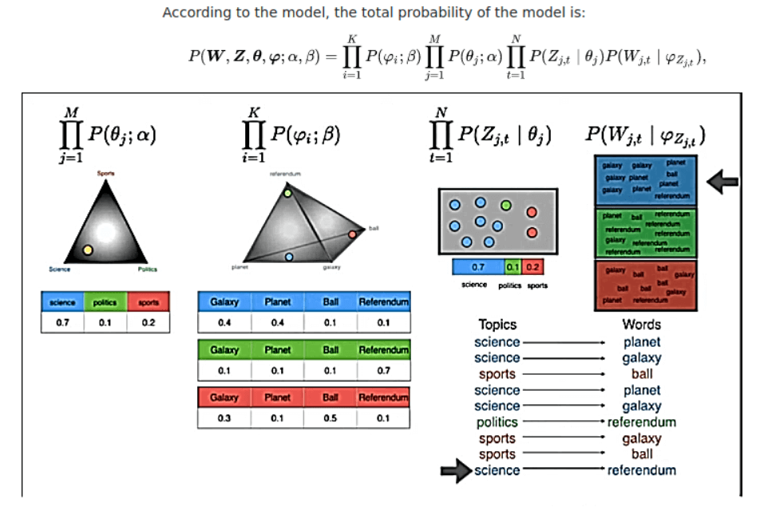
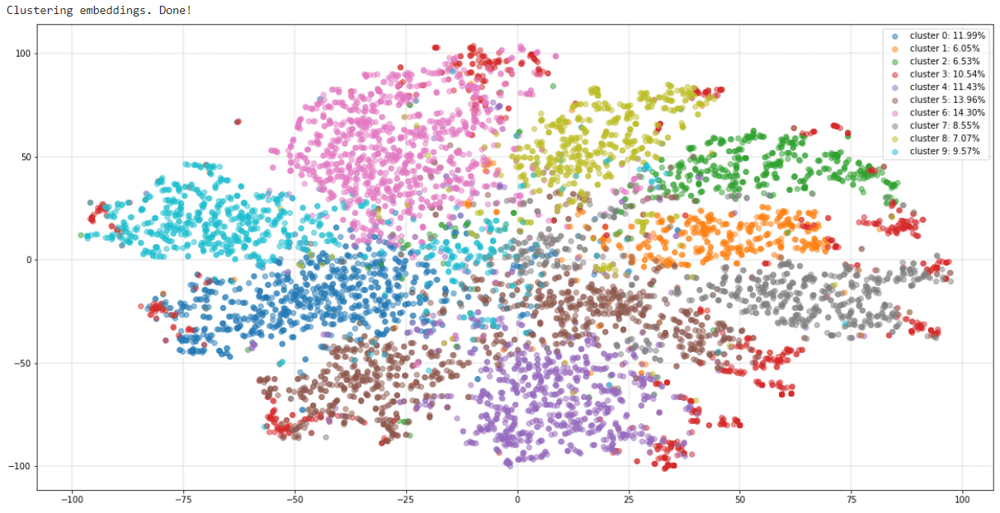
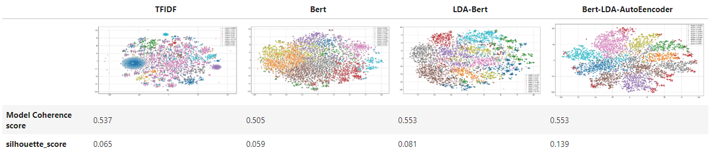

# DataPro 
__An Aspiring Data Scientist__

## [Project 1: Student Plagiarism Detection](https://github.com/DataPro-M/66daysofdata_NLP/tree/main/day21)

To score ratings, this project ran student work through a language model that was trained on original text data.
A higher score indicates that the work is more predicted based on the training data, and therefore it is more likely to be plagiarized. 
* **Python libraries used:** nltk, pandas, scipy
* **Input:** A Corpus of Plagiarised Short Answers
* **Output:** Plagiarism Detector model

> The plagiarized words are represented by the darker colored pixels.
> This approach allows determining whether sections of a document have been plagiarized much easier.

`Containment score:` a plagiarism similarity measurement

 

`Longest Common Subsequence` a plagiarism similarity measurement

 

_**Note:** The most difficult type of plagiarism to identify is `heavy answers`, which are based on the original material but heavily rewritten._

### `Multi-class Classification`

*** 

## [Project 2: Topic Modeling Task](https://github.com/DataPro-M/66daysofdata_NLP/tree/main/day14-19)

<h3 style='text-align: center;'>
    Kaggle Steam Review Dataset
</h3>

The job of extracting the key themes (expressed as a set of words) that appear in a collection of 
texts using unsupervised learning is known as `topic modelling`.

I put the algorithm to the test using Kaggle's Steam Review Datasets.
It includes 380,000 video game reviews from 46 of Steam's best-selling titles.
 
* **Python libraries used:** language-detector, symspellpy, pyLDAvis, sentence-transformers, gensim, sklearn
* **Input:** Datasets for Steam Reviews
* **Output:** ~ 75000 sample reviews were grouped into ten categories. 

### TF-IDF 
It `loses contextual information` and suffers from the data being incoherent and unstructured

### LDA 
The model says in what percentage each document talks about each topic
 

### BERT sentence embedding 
Sentence embedding models (BERT) is used to `embed reviews into a vector space` where the vectors capture the `contextual meaning of sentences`. 

### `Topic modeling results`

